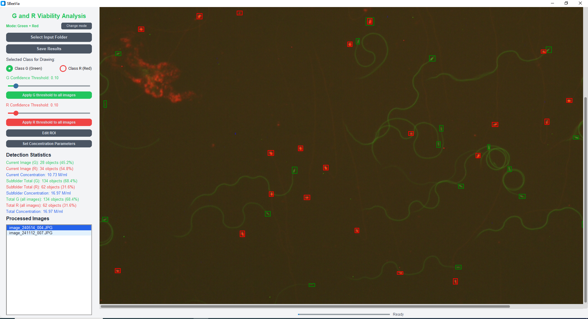
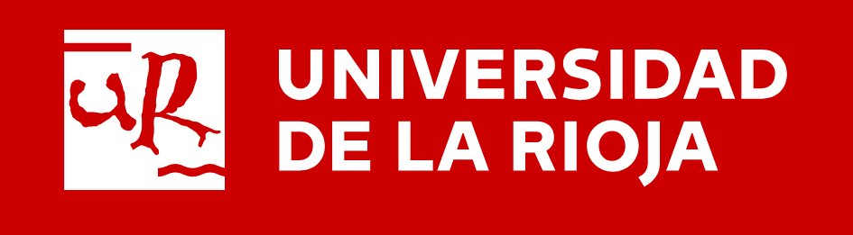

# SBeeVia

<p>SBeeVia (<b>S</b>perm <b>Bee</b> <b>Via</b>bility) is a <b>free and open-source</b> tool designed to automatically assess sperm viability and sperm concentration in honey bee drones (<i>Apis mellifera</i>) from fluorescence microscopy images.
The software runs on low-range computers (no GPU is needed). <b>Neither installation nor internet connection is needed</b>, just double-click on the executable.</p>

<p>The detection process is based on YOLO nano models (currently, YOLOv11 nano) specifically trained on multiple fluorescence microscopy images to identify and classify live and dead spermatozoa.</p>




## 🟢🔵 Two Colour Modes

SBeeVia supports two fluorochrome combinations in a single unified application. At startup, select the colour mode that matches your staining protocol:

- **Green/Red** — for SYBR-14/PI and Acridine Orange/PI images
- **Blue/Red** — for Hoechst 33342/PI images

The mode can be switched at any time from within the application.

## ⚡ Execution Options

#### Option 1: Executable File (Recommended)
1. Download the SBeeVia executable file for [Windows](https://github.com/jodivaso/SBeeVia/releases/download/v0.0.1/SBeeVia.exe) (Linux and macOS coming soon).
2. Run the executable file.

*Note:* This file is self-contained, so the application takes a few seconds to start since the contents must be unzipped on the fly.

#### Option 2: Run from Source
1. Clone this repository:
```bash
git clone https://github.com/jodivaso/SBeeVia.git
```

2. Install the required dependencies:
```bash
pip install -r requirements.txt
```

3. Run the application:
```bash
python SBeeVia.py
```


## Features

- **Dual Colour Mode**: Supports Green/Red (SYBR-14/PI, AO/PI) and Blue/Red (Hoechst 33342/PI) staining protocols in a single application
- **AI-powered Detection**: Uses YOLO nano models to identify and classify live and dead spermatozoa
- **Sperm Viability**: Automatically computes viability percentages (live vs. dead) per image, subfolder, and globally
- **Sperm Concentration**: Estimates sperm concentration (M/mL) based on configurable chamber depth, dilution ratio, and scale parameters
- **Confidence Threshold**: Adjustable detection sensitivity per class (Green/Blue and Red), per image or globally
- **Region of Interest (ROI)**: Define polygonal areas to restrict counting to specific regions
- **Subfolder Support**: Processes nested folder structures for batch analysis
- **Comprehensive Statistics**: Per-image, subfolder, and total counts with viability percentages and concentration estimates
- **Manual Editing**: Add, delete, move, and resize detection boxes; switch between classes
- **Concentration Parameters**: Configurable camera depth, dilution ratio (X:Y), and scale (µm/pixel)

## Controls

- **Zoom**: Mouse wheel
- **Pan**: Middle mouse button
- **Add sperm manually**: Left click and drag (class selected in sidebar)
- **Delete detection**: Right click on detection box
- **Hide detections**: Press and hold `h` key
- **Switch selected class**: Press `g` (Green mode) or `b` (Blue mode) / `r` (Red)
- **View different images**: Click on image names in the list
- **Remove image from analysis**: Right click on image name in the list

## Working with Regions of Interest (ROI)

1. Select an image
2. Click "Edit ROI"
3. Left click to add points around your area of interest
4. Double click to complete the polygon (drawn in yellow)
5. Statistics will update to count only spermatozoa within the ROI
6. Right click to delete the current ROI

## Setting Concentration Parameters

Click "Set Concentration Parameters" to configure:

- **Camera Depth (µm)**: Optical section depth of the counting chamber (e.g., 10 µm for a Makler or Spermvu10P chamber)
- **Dilution Ratio (X:Y)**: Parts of semen (X) to parts of diluent (Y). The dilution factor is computed as (X+Y)/X
- **Scale (µm/pixel)**: Microns per pixel in the image

These parameters are used to calculate sperm concentration from the detected cell counts and the known imaging volume.

## Saving Results

When you click "Save Results", a `Results` folder is created in your input folder containing:

- **images/**: All processed images with visible detection boxes and count annotations
- **labels/**: YOLO format text files with detection coordinates
- **statistics.csv**: Detailed counts for each image (viability percentages, concentration, ROI info)
- **statistics_subfolders.csv**: Summary statistics aggregated by subfolder

## Output Format

### statistics.csv
| Column | Description |
|---|---|
| `filename` | Relative path to the image |
| `threshold_G` / `threshold_B` | Confidence threshold for the non-red class |
| `threshold_R` | Confidence threshold for the red (dead) class |
| `G_count` / `B_count` | Number of live spermatozoa detected |
| `R_count` | Number of dead spermatozoa detected |
| `total_count` | Total spermatozoa in this image |
| `G_percentage` / `B_percentage` | Percentage of live spermatozoa (viability) |
| `has_roi` | Whether a Region of Interest was applied |
| `concentration_M_ml` | Estimated sperm concentration (millions/mL) |

### statistics_subfolders.csv
| Column | Description |
|---|---|
| `subfolder` | Subfolder path |
| `image_count` | Number of images in this subfolder |
| `image_list` | List of image filenames |
| `G_count` / `B_count` | Total live spermatozoa in this subfolder |
| `R_count` | Total dead spermatozoa in this subfolder |
| `total_detections` | Total spermatozoa detected |
| `G_percentage` / `B_percentage` | Viability percentage for the subfolder |
| `images_with_roi` | Number of images with ROI applied |
| `concentration_M_ml` | Average concentration across the subfolder |

## Acknowledgments

This research has been funded by:
- Grant INICIA2023/02 by La Rioja Government (Spain)
- MCIU/AEI/10.13039/501100011033 (grants PID2023-148475OB-I00 and PID2024-157733NB-I00)
- The DGA-FSE (grant A07_23R)

## License

This software uses YOLOv11 nano models; thus, it is licensed under the GNU Affero General Public License v3.0 (AGPL-3.0).

&nbsp;&nbsp;&nbsp;&nbsp;
